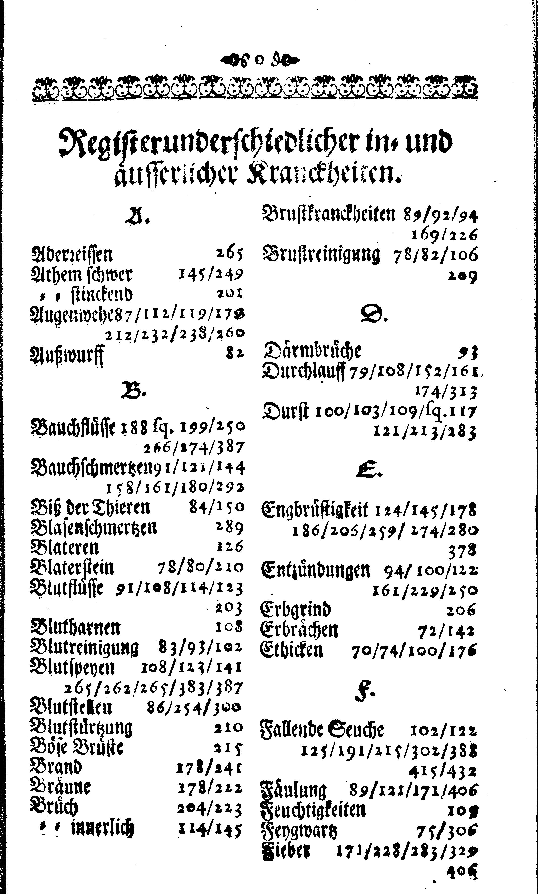
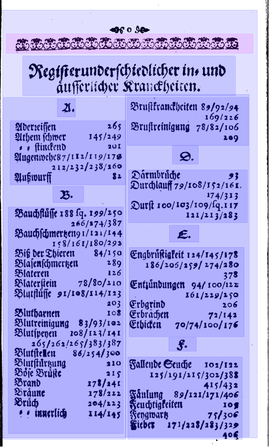
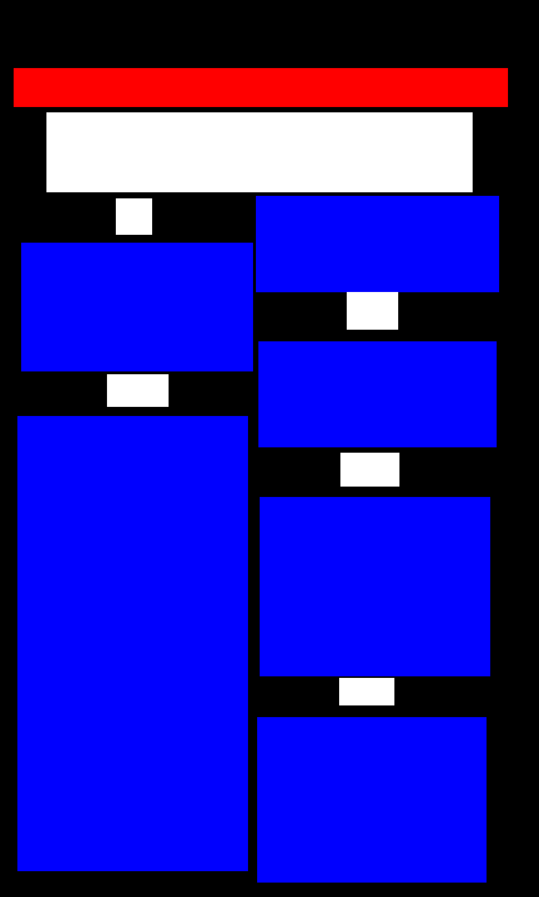
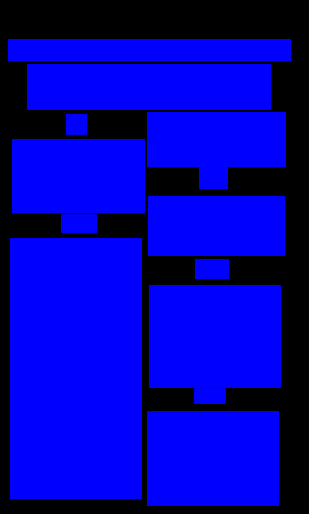
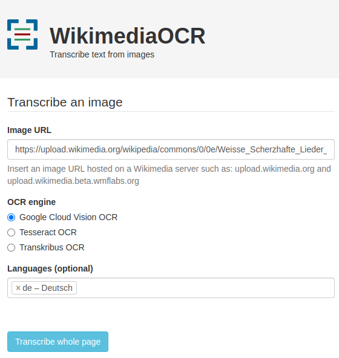
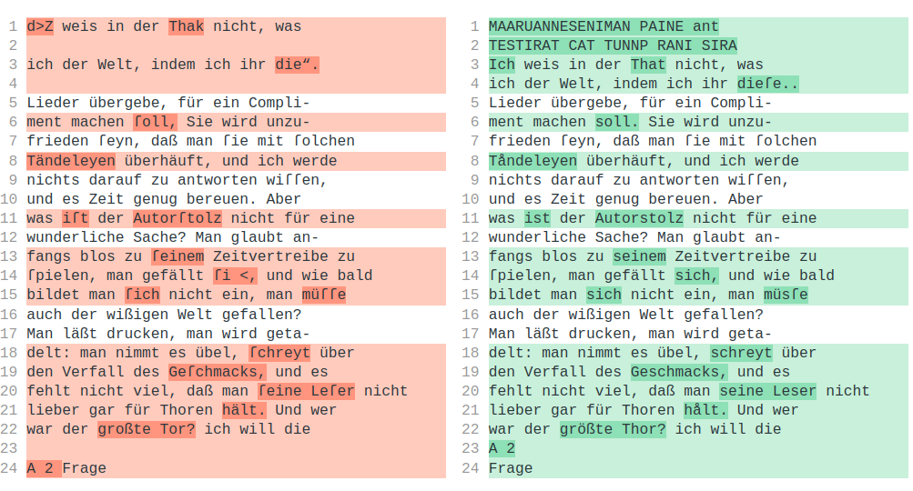
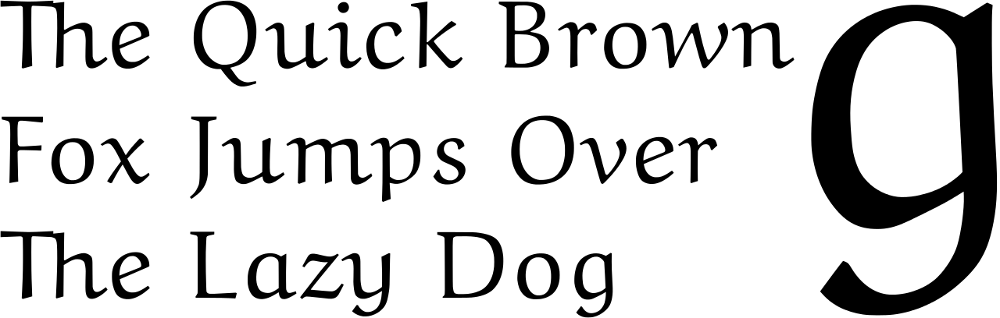

layout: true
  
<div class="my-header"></div>

<div class="my-footer">
  <table>
    <tr>
      <td style="text-align:right">Sächsische Landesbibliothek – Staats- und Universitätsbibliothek</td>
      <td>Date</td>
      <td style="text-align:right"><a href="https://www.slub-dresden.de/">www.slub-dresden.de</a></td>
    </tr>
    <tr>
      <td style="text-align:right">Referate 2.5 & 4.3</td>
      <td />
    </tr>
  </table>
</div>

<div class="my-title-footer">
  <table>
    <tr>
      <td style="text-align:left"><b>Robert Sachunsky & Kay-Michael Würzner</b></td>
    </tr>
    <tr>
      <td style="text-align:left">Referate 2.5 bzw. 4.3</td>
    </tr>
    <tr>
      <td style="font-size:8pt"><b>30. Juni 2023</b></td>
    </tr>
    <tr>
      <td style="font-size:8pt">Seminar *Datenkompetenz für Digital Humanities*</td>
    </tr>
  </table>
</div>

---

class: title-slide
count: false

# Optical Character Recognition
## Vom Bild zum Text

---

# Überblick

- Kurze Einführung OCR
- Hands-on Web: OCR mit Wikimedia
- Demo Shell: OCR mit Tesseract
- Hands-on Python: OCR mit Tesserocr
- Demo *komplex*: optimierte OCR mit OCR-D

---

class: part-slide
count: false

# Kurze Einführung OCR

---

# Kurze Einführung OCR

.cols[
.sixty[
- Bilderfassung ≠ Texterfassung
- **O**ptical **C**haracter **R**ecognition: Automatische Erfassung von Text in Bildern
- ursprünglich begrenzt auf Zeichenerkennung
- heute häufig Synonym für den gesamten Texterfassungsprozess
  + Bildvorverarbeitung
  + Layoutanalyse (OLR)
  + Zeilenerkennung
  + ...
]
.fourty[
<center></center>
]
]

---

# Komponenten eines einfachen OCR-Workflows

.cols[
.fifty[
]
.fourty[
<p style="margin-top:-80px">

</p>
]
]

---

count: false

# Komponenten eines einfachen OCR-Workflows

.cols[
.fifty[
- Bildvorverarbeitung
]
.fourty[
<p style="margin-top:-80px">

</p>
]
]

---

count: false

# Komponenten eines einfachen OCR-Workflows

.cols[
.fifty[
- Bildvorverarbeitung
]
.fourty[
<p style="margin-top:-80px">

</p>
]
]

---

count: false

# Komponenten eines einfachen OCR-Workflows

.cols[
.fifty[
- Bildvorverarbeitung
- Layoutanalyse
]
.fourty[
<p style="margin-top:-80px">

</p>
]
]

---

count: false

# Komponenten eines einfachen OCR-Workflows

.cols[
.fifty[
- Bildvorverarbeitung
- Layoutanalyse
]
.fourty[
<p style="margin-top:-80px">

</p>
]
]

---

count: false

# Komponenten eines einfachen OCR-Workflows

.cols[
.fifty[
- Bildvorverarbeitung
- Layoutanalyse
    * **strukturierende** Elemente
        + Absätze
        + Überschriften
]
.fourty[
<p style="margin-top:-80px">

</p>
]
]

---

count: false

# Komponenten eines einfachen OCR-Workflows

.cols[
.fifty[
- Bildvorverarbeitung
- Layoutanalyse
    * **strukturierende** Elemente
        + Absätze
        + Überschriften
    * **textflussunterbrechende** Elemente
        + Seitenzahlen
        + Kolumnentitel
        + Abbildungsunterschriften
        + Marginalien etc.
]
.fourty[
<p style="margin-top:-80px">

</p>
]
]

---

count: false

# Komponenten eines einfachen OCR-Workflows

.cols[
.fifty[
- Bildvorverarbeitung
- Layoutanalyse
    * **strukturierende** Elemente
        + Absätze
        + Überschriften
    * **textflussunterbrechende** Elemente
        + Seitenzahlen
        + Kolumnentitel
        + Abbildungsunterschriften
        + Marginalien etc.
    * **nichttextuelle** Elemente
        + Abbildungen
        + Tabellen etc.
]
.fourty[
<p style="margin-top:-80px">

</p>
]
]

---

count: false

# Komponenten eines einfachen OCR-Workflows

.cols[
.fifty[
- Bildvorverarbeitung
- Layoutanalyse
    * **strukturierende** Elemente
        + Absätze
        + Überschriften
    * **textflussunterbrechende** Elemente
        + Seitenzahlen
        + Kolumnentitel
        + Abbildungsunterschriften
        + Marginalien etc.
    * **nichttextuelle** Elemente
        + Abbildungen
        + Tabellen etc.
- Texterkennung
]
.fourty[
<p style="margin-top:-80px">

</p>
]
]

---

# Texterkennung: Technik

- Erkennung erfolgt *zeilenweise*
  1. **Skalierung:** einheitliche Höhe für alle Zeilen
  2. **Merkmalsextraktion**: Raster mit festgelegter Anzahl (horizontaler) Zeilen und variabler Anzahl (vertikaler) Spalten → Zeilen als Sequenzen binärwertiger Vektoren fixer Länge
<center></center>
- kontextsensitive Erkennung über *Übergangswahrscheinlichkeiten* der Vektoren
- Zerlegung der Seite in *Zeilen* notwendig
- Vorgehen robuster gegenüber Varianz durch Artefakte als zeichenorientierte Ansätze
- `Tesseract` (ab Version 4), `OCRopus`, `kraken`, `Calamari`
  + Einsatz *neuronaler Netze* für die Sequenzklassifikation

---

# Texterkennung: Technik

- Sequenzklassfikation
    + Daten
        * https://htr-united.github.io/
        * manuell transkribierte Textzeilen
    + Kodierung `\(f: \mathbb{N}^{10}\rightarrow\mathbb{B}\)` 
      $$
      f(x[n]) = \begin{cases} 1 & \text{Pixel in Zelle $(x,n)$ schwarz} \\\\
      0 & \, \text{sonst}\end{cases}
      $$ 
    + Training
        * Zählen von Sequenzen aus Vektor-Buchstabenteil-Paaren
        * Repräsentation als OCR-Modell
        * Tesseract: [tesstrain](https://github.com/tesseract-ocr/tesstrain)
.cols[
.fifty[
```
  0123456789
0 1111111111
2 0000110000 
```
]
.fifty[
<center>

</center>
]
]

---

# *Layoutanalyse* per Pixelklassifizierung

.cols[
.fifty[
]
.fourty[
<p style="margin-top:-30px">

</p>
]
]

---

count: false

# *Layoutanalyse* per Pixelklassifizierung

.cols[
.fifty[
- Training auf manuell strukturierten Seiten
- jedes Pixel gehört in ein Segment
- jedes Pixel gehört zu einer Klasse
]
.fourty[
<p style="margin-top:-30px">

</p>
]
]

---

count: false

# *Layoutanalyse* per Pixelklassifizierung

.cols[
.fifty[
- Training auf manuell strukturierten Seiten
- jedes Pixel gehört in ein Segment
- jedes Pixel gehört zu einer Klasse
]
.fourty[
<p style="margin-top:-30px">

</p>
]
]

---

count: false

# *Layoutanalyse* per Pixelklassifizierung

.cols[
.fifty[
- Training auf manuell strukturierten Seiten
- jedes Pixel gehört in ein Segment
- jedes Pixel gehört zu einer Klasse
    + Illustration durch Farbe pro Segmenttyp
]
.fourty[
<p style="margin-top:-30px">

</p>
]
]

---

count: false

# *Layoutanalyse* per Pixelklassifizierung

.cols[
.fifty[
- Training auf manuell strukturierten Seiten
- jedes Pixel gehört in ein Segment
- jedes Pixel gehört zu einer Klasse
    + Illustration durch Farbe pro Segmenttyp
]
.fourty[
<p style="margin-top:-30px">

</p>
]
]

---

count: false

# *Layoutanalyse* per Pixelklassifizierung

.cols[
.fifty[
- Training auf manuell strukturierten Seiten
- jedes Pixel gehört in ein Segment
- jedes Pixel gehört zu einer Klasse
    + Illustration durch Farbe pro Segmenttyp
- Klassifikation der Pixel anhand ihrer **Umgebung** (i.e. Farbe im Original)
]
.fourty[
<p style="margin-top:-30px">

</p>
]
]

---

count: false

# *Layoutanalyse* per Pixelklassifizierung

.cols[
.fifty[
- Training auf manuell strukturierten Seiten
- jedes Pixel gehört in ein Segment
- jedes Pixel gehört zu einer Klasse
    + Illustration durch Farbe pro Segmenttyp
- Klassifikation der Pixel anhand ihrer Umgebung (i.e. Farbe im Original)
    + beliebig komplexe Schemata möglich
        * Text vs. Nichttext
]
.fourty[
<p style="margin-top:-30px">

</p>
]
]

---

count: false

# *Layoutanalyse* per Pixelklassifizierung

.cols[
.fifty[
- Training auf manuell strukturierten Seiten
- jedes Pixel gehört in ein Segment
- jedes Pixel gehört zu einer Klasse
  + Illustration durch Farbe pro Segmenttyp
- Klassifikation der Pixel anhand ihrer Umgebung (i.e. Farbe im Original)
  + beliebig komplexe Schemata möglich
      * Text vs. Nichttext
]
.fourty[
<p style="margin-top:-30px">

</p>
]
]

---

class: part-slide
count: false

# OCR mit Wikimedia

---

# OCR mit Wikimedia

- einfaches Webinterface zur OCR von Wikimedia-Inhalten

<center>

</center>

→ [ocr-test.wmcloud.org](https://ocr-test.wmcloud.org/)

---

# OCR mit Wikimedia

Aufgabe
- Suchen Sie sich ein [geeignetes Bild](https://upload.wikimedia.org/wikipedia/commons/0/0e/Weisse_Scherzhafte_Lieder_003.jpg) bei Wikimedia.Commons (Tipp: via Wikisource)!
- Führen Sie eine OCR aus!
- Kopieren Sie sich das Textresultat!
- Führen Sie eine zweite OCR mit veränderten Parametern aus!
- Kopieren Sie sich das Textresultat
- Vergleichen Sie die Ergebnisse auf [diffchecker](https://www.diffchecker.com/)! Was fällt Ihnen alles auf?

---

# OCR mit Wikimedia

<center>

</center>


---

class: part-slide
count: false

# OCR mit Tesseract

---

# OCR mit Tesseract

- mit großem Abstand: verbreitetste OCR-Software
    + Einsatz in unzähligen Apps, Forschungsprojekten, privaten Kontexten
- kostenlos verwendbar, quelloffen entwickelt
- Teil praktisch aller **Linux**distributionen
    + Installation auf MacOS per `Homebrew` und `MacPorts` möglich
    + Installation unter Windows per [Installer](https://github.com/UB-Mannheim/tesseract/wiki) möglich
- Zugriff auf Tesseract per
    + Programmierschnittstelle (API)
    + **Kommandozeilenschnittstelle** (CLI)
    + graphische Benutzeroberfläche (GUI, Drittanbieter)
- Erkennunsgmodelle für zahlreiche Sprachen bzw. Schriften vorhanden
    + teilweise als installierbare Pakete
    + empfehlenswert jedoch Download von [GitHub](https://github.com/tesseract-ocr/tessdata_best)

---

# OCR mit Tesseract

- Prinzipielle Kommandostruktur
```
tesseract EINGABEBILD AUSGABE (OPTIONEN) (AUSGABEKONFIGURATION)
```
- einfachster Aufruf
```
$ tesseract sample.png -
```
    + `-` schickt die Ergebnisse nach `stdout`
    + Modell `eng` per default ausgewählt
    + Konfiguration `txt` per default ausgewählt

.cols[
.sixty[
```
The Quick Brown
Fox Jumps Over
The Lazy Dog
```
]
.fourty[
<center>

<p style="font-size:4pt;">Image by Peter J. Acklam, public domain</p>
</center>
]
]

---

# OCR mit Tesseract

- Modellauswahl
    + Option `-l MODELLNAME`, Datei `MODELLNAME.traineddata` nötig
    + eventuell in Kombination mit `--tessdata-dir`
    + Kombination mehrerer Modelle möglich:
      `-l MODELLNAME+MODELLNAME2+MODELLNAME3`
- Segmentierung
    + Option `-psm MODUS` (Liste verfügbarer Optionen via `--help-psm`)
    + Möglichkeit einzelne Absätze, Zeilen oder gar Wörter zu verarbeiten
- Bildauflösung
    + wichtiger Faktor für Ergebnisqualität
    + idealerweise min. 300 dpi
    + unter Umständen Teil der Metadaten, anonsten: `Warning: Invalid resolution 0 dpi. Using 70 instead.`
    + manuell per `--dpi` setzbar

---

class: part-slide
count: false

# OCR mit Tesserocr

---

# OCR mit Tesserocr

- [Python-API](https://github.com/sirfz/tesserocr) für Tesseract
- enge Kopplung von Python-Bibliotheken und OCR mgl.
- volle Kontrolle über alle Tesseractfunktionalitäten

```python
from tesserocr import PyTessBaseAPI

images = ['sample.jpg', 'sample2.jpg', 'sample3.jpg']

with PyTessBaseAPI() as api:
    for img in images:
        api.SetImageFile(img)
        print(api.GetUTF8Text())
        print(api.AllWordConfidences())
```

---

# OCR mit Tesserocr

→ [Hands-on](https://github.com/rue-a/ocrd_python_codespace)

---

class: part-slide
count: false

# optimierte OCR mit OCR-D

---

# optimierte OCR mit OCR-D

.cols[
.fourty[
- Tesseract: gute Basis-OCR
- für herausfordernde Materialen nicht ohne weiteres geeignet
- Weiteres: OCR-D
]
.sixty[

]
]

---

# optimierte OCR mit OCR-D

- DFG-Initiative zur Verbesserung von OCR-Methoden für historische Drucke
- `ocrd`: Python-Bibliothek zur Integration verschiedener OCR-Werkzeuge
- modularer Ansatz

> Nimm die Binarisierung von Ocropus, die Segmentierung von Tesseract und die Texterkennung von Calamari

- quelloffen und frei nachnutzbar
- leichte Integration neuer Werkzeuge

→ Demo

---

class: part-slide

# Vielen Dank für Ihre Aufmerksamkeit!

<center>
<a href="https://wrznr.github.io/dhm-dk-ocr-2023/">wrznr.github.io/dhm-dk-ocr-2023</a>
</center>
